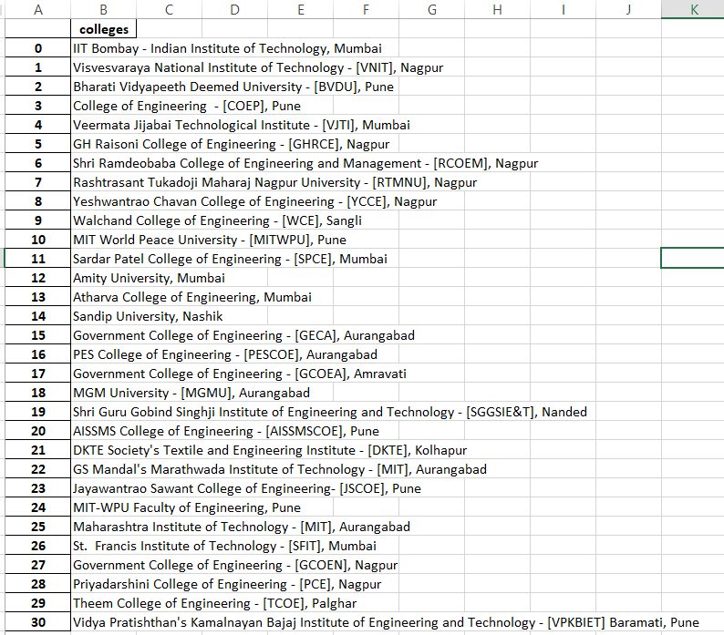

# Collegedunia - A Web Scraper Written in Pytho
## Table of contents

- [Overview](#overview)
- [Installation](#installation)
- [Screenshot](#screenshot)
- [Built with](#built-with)
- [Author](#author)


## Overview
A Web Scraper Written in Python.
Scrapes all College names along with their location


### Installation
#### Step 1:

Download or clone this repository

#### Step 2:

Install the required packages using the command below

```
pip install -r requirements.txt
```

#### Step 3:

If you dont already have the chrome driver then download one from here:
https://chromedriver.chromium.org/downloads <br>
**Note:Check your chrome version and download the appropiate chrome driver and add it to the path

#### Step 3:

Run the Project using the command

```
python main.py
```
### Screenshot

 

### Built with


## Author
 - Hayden Cordeiro   
 [](https://www.linkedin.com/in/haydencordeiro/)
 [](https://github.com/haydencordeiro)  


