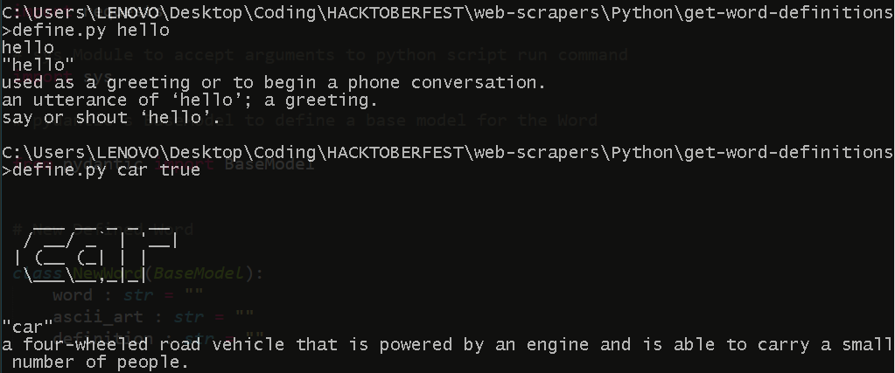

# Web Scraper to get word definitions from the Dictionary API

## Prerequisites
Modules required to be able to use the script successfully are mentioned in the `requirements.txt` file, and can be installed by:
```bash
  pip install -r requirements.txt
```

## Usage

### As a Script
To get started run :
```bash
  python main.py word
``` 
replacing "word" with the word you wish to define.

This will print out the word and the word meaning. As an additional feature, you can raise
the ASCII Art flag by adding the "true" (case insensitive) argument like so:
```bash
  python main.py word true
``` 

This flag prints an ASCII Art version of the word to be defined.

If you have `lolcat` installed on your terminal, I suggest piping it through `lolcat` for aesthetic results.

### As a module

- Import this file by renaming the file to something else (for example, `define.py`) so that you can import it using ```from define import *``` or rename the folder to something else (for example `define`) so you can import it using ```from define.main import *```

- Use the command ```DefineAWord(word=your_word,get_ascii_art = get_ascii).run_scrap()``` where:

| Parameter    | Type      | Description                       |
| :--------    | :-------  | :-------------                    |
| `yourword`   | `string`  | the word you wish to define       |
| `get_ascii`  | `boolean` | if you wish for ascii art as well |

this will return to you a "NewWord" object with methods/attributes :

| Parameter     | Type      | Description                          |
| :--------     | :-------  | :-------------                       |
| `word`        | `string`  | the word you wish to define          |
| `ascii_art`   | `string`  | a nice looking ASCII art of the word |
| `definition`  | `string`  | the definition of the word           |

## Screenshot/GIF showing the sample use of the script


<a href="https://aaditya.intellx.co.in">`script by Aaditya Rengarajan for Hacktoberfest 2021, timestamp : 13:38:55IST October 21 2021`</a> (see <a href="https://github.com/aadityarengarajan">aadityarengarajan</a>)